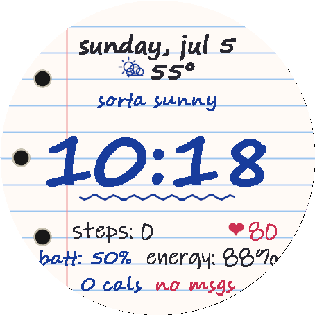

<div align="center">

# 📝 Passed Note Watch Face

**A Garmin watch face that looks like a note teenagers pass to each other in class.**

Written in [Monkey C](https://developer.garmin.com/connect-iq/monkey-c/) for Connect IQ.

[](LICENSE)
[](https://developer.garmin.com/connect-iq/)
[](#-hardware--scaling)
[](manifest.xml)

</div>

---

<table>
<tr>
<td width="55%" valign="top">

Passed Note turns your watch into a scrap of lined notebook filler paper —
light-blue rules, a red margin line, punch holes hugging the left curve — with
everything **handwritten in a different kid's handwriting**, in blue and black
ballpoint with the occasional red gel pen:

- 🗓️ **The date** — "sunday, jul 5" in neat black printing
- 🌤️ **The weather, doodled** — a dynamic pen-sketch icon (sun, clouds, rain,
  snow, or a storm cloud with red lightning) that matches the live conditions,
  the temperature beside it, and the day's condition word ("sorta sunny",
  "rainy", "storms!") in blue cursive underneath
- 🕒 **The time** — written HUGE in loopy blue script with an emphatic
  squiggle underline (pick your pen: blue, black, or red)
- 👟 **Steps** in a quick black scrawl, with your **heart rate** doodled in
  red beside a little heart
- 🔋 **Battery** in someone else's blue cursive next to your **Body Battery**
  ("energy: 87%")
- 🔥 **Calories** and your **notification count** ("3 msgs!") squeezed onto
  the last rule
- 😴 **Burn-in-safe Always-On** — black page, just the time in dim ink,
  nudged each minute

Every line of handwriting sits ON the notebook rules, like the real thing.

</td>
<td width="45%" valign="top" align="center">



<sub><i>Live render on a 454×454 AMOLED panel</i></sub>

</td>
</tr>
</table>

---

## ✨ Features

| | |
|---|---|
| **Four real handwriting fonts** | The time, date, stats, and notes are each "written" by a different kid — Segoe Script, Segoe Print, and Ink Free, baked into per-resolution bitmap fonts. |
| **Dynamic weather doodle** | The icon is sketched in pen strokes and switches with the live conditions: sun, sun-behind-cloud, cloud, rain, snowflake, or a storm cloud with a red lightning bolt. |
| **Notebook paper, drawn procedurally** | Rules, margin, and punch holes are all drawn to scale on every panel size — no background bitmaps. |
| **Settings** | Choose which pen wrote the time (blue / black / red), the paper style (white filler paper or a yellow legal pad), and toggle the weather block and heart-rate doodle. |
| **Always-On mode** | On AMOLED watches the sleeping face is a black page with just the time in dim ink, shifted a little each minute to satisfy burn-in protection. |
| **Graceful degradation** | Weather, Body Battery, and heart rate all hide cleanly when the device has no data — the note just gets shorter. |

## ⚙️ Settings

Configure from the Connect IQ store app / Garmin Connect mobile:

| Setting | Options | Default |
|---|---|---|
| **Time Pen** | 🖊 Blue ballpoint · ✒ Black ballpoint · ❤ Red gel pen | Blue |
| **Paper** | 📄 Notebook paper · 📒 Yellow legal pad | Notebook |
| **Show Weather** | on / off | on |
| **Show Heart Rate** | on / off | on |

## 📱 Hardware & Scaling

Targets **Connect IQ 4.0+ round watches** — Forerunner, fenix / epix / enduro,
Venu / vivoactive, AMOLED Instinct, and the Approach / Descent / D2 / MARQ
specialty families. The layout is computed relative to the screen size, and
`tools/gen_fonts.py` bakes a correctly-sized handwriting font set for every
distinct panel resolution (454 / 416 / 390 / 360 / 280 / 260 / 240 / 218);
`monkey.jungle` maps each product to its set. Monochrome MIP Instincts are not
targeted — white paper with blue and black ink needs a colour display.

## 🔨 Building

```powershell
# Compile for a specific device (defaults to fenix847mm / 454x454)
.\build.ps1 -Device fenix847mm

# Compile and launch in the simulator
.\build.ps1 -Run

# Package a store-ready .iq bundle (all products in the manifest)
.\build.ps1 -Export
```

On first run, `build.ps1` writes a `build_config.json` (git-ignored) with your
local `JavaHome` and `SdkDir` paths — edit it to match your machine. See
[CONTRIBUTING.md](CONTRIBUTING.md) for the full development setup, including
regenerating the handwriting fonts.

## 📄 License

[MIT](LICENSE) — the Segoe Script, Segoe Print, and Ink Free typefaces are
Microsoft system fonts; the baked bitmap glyphs are included for building the
face.
